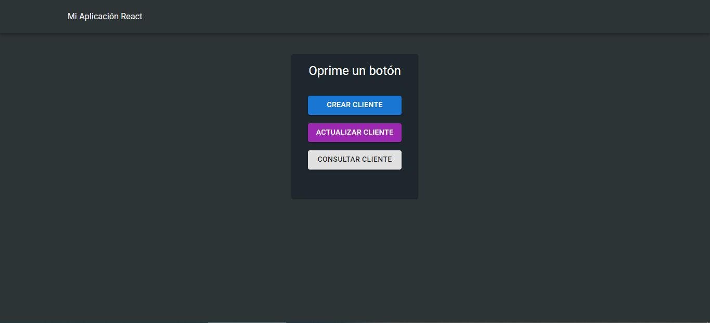
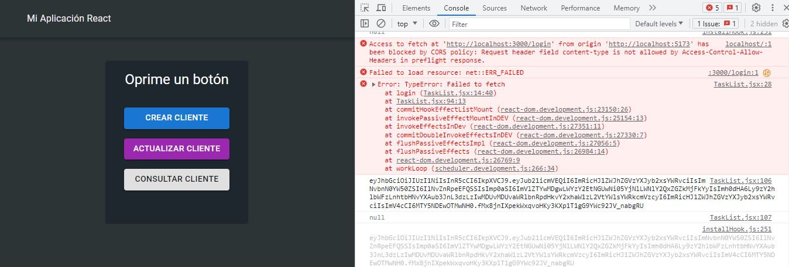

# Prueba técnica Desarrollador Fullstack en Softix.

## Tabla de contenido

- [Prueba](#Prueba)
  - [The challenge](#the-challenge)
  - [Screenshot](#screenshot)
- [Mi proceso](#Mi-proceso)
  - [Construido en](#Construido-en)
  - [Que aprendí](#Que-aprendí)
- [Autor](#athor)

## Prueba

### The challenge

Por favor, completa las siguientes tareas utilizando React, HTML, CSS y cualquier otra tecnología
necesaria.
Puedes buscar en línea y usar recursos de referencia para completar la prueba.
Puedes utilizar cualquier editor de código que prefieras para escribir y probar tu código.
Tarea 1: Crear una Aplicación React

1. Crea una aplicación React que haga lo siguiente:
2. Utiliza create-react-app o configura el entorno de React de tu elección.
3. Crea un componente llamado Header que muestre el título "Mi Aplicación React" en un
encabezado.
4. Crea un componente llamado Button que muestre un botón que diga "Crear cliente".
5. Crea un componente llamado Button que muestre un botón que diga "Actualizar cliente".
6. Crea un componente llamado Button que muestre un botón que diga "Consultar cliente".

Tarea 2: Consumir una API para Obtener Datos
1. Utiliza la API pública (https://www.softix.site/API/) para obtener una lista de clientes
(/posts).
Credenciales:
{
"email": "xxxxx",
"password": "xxxxx"
}

2. Cuando se haga clic en el botón "Crear cliente", utiliza el estado de React para hacer una
solicitud a la API y mostrar un mensaje de “Se creó el cliente correctamente”
3. Cuando se haga clic en el botón "Actualizar cliente", utiliza el estado de React para hacer
una solicitud a la API y mostrar un mensaje de “Se Actualizo el cliente correctamente”
4. Cuando se haga clic en el botón "Consultar cliente", utiliza el estado de React para hacer
una solicitud a la API y mostrar la inserción, actualización.

Tarea 3: Estilizar la Aplicación
1. Utiliza CSS para aplicar estilo a la aplicación.
2. Estiliza los componentes para que tengan una apariencia profesional.
3. Asegúrate de que la aplicación sea visualmente atractiva y legible en diferentes tamaños
de pantalla utilizando diseño responsivo.

### Screenshot

## Mi proceso

Comencé realizando la interfaz gráfica con la aydua de material UI. Una vez hecha, Intenté hacer llamados a la API pero me encontré con problemas de politicas del CORS que me retrasaron mi trabajo.
Investigando en internet encontré varias soluciones pero ninguna de estas me funcionaba, por lo que accedí a crear una pequeña apliación en express para consumir la API y crear nuevos endpoins
para luego volverlos a consumir desde el Front-End. Únicamente logré loguearme correctamente y conseguir el Token de JWT.

### Built with

- React.Js
- Express
- Material UI

### Que aprendí

Como solucionar las politicas del CORS por medio de Express y Node.js.

## Autor

- LinkedIn - [Juan Pablo Cuartas](https://www.your-site.com)
- Email - [juanpa88842@gmail.com](https://www.linkedin.com/in/juanpablocuartas/)
